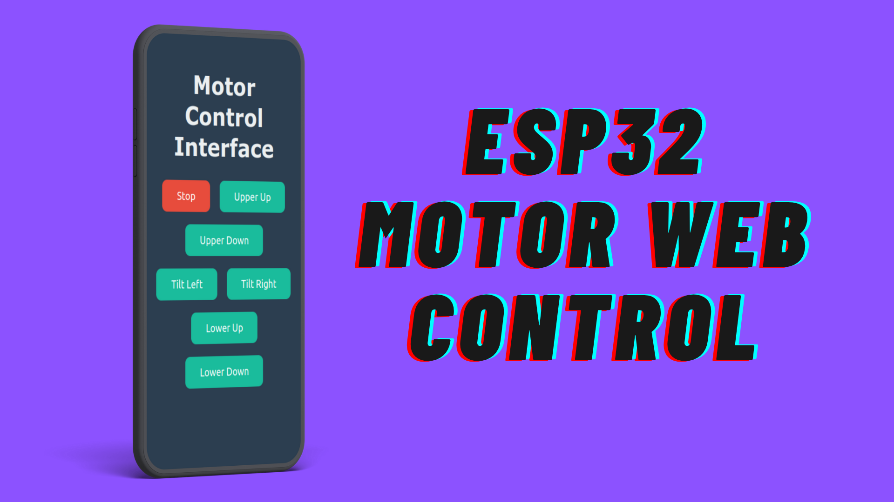

# ESP32 Motor Control via Web Interface

This project allows you to control three motors connected to an ESP32 using a web interface. The motors are controlled via PWM and direction pins, and the web interface enables commands like stopping the motors or moving them up and down.



## Hardware Requirements
- ESP32 microcontroller
- DC Motors (3x)
- Motor Driver (e.g., Citron motor driver or equivalent)
- WiFi router or hotspot
- Jumper wires
- Power supply for the motors

## Software Requirements
- Arduino IDE (with ESP32 board installed)
- GitHub for documentation
- Web browser for accessing the ESP32 web interface

## Circuit Diagram

Connect the motors to the ESP32 and the motor driver as follows:

| Motor      | PWM Pin | DIR Pin |
|------------|---------|---------|
| Upper      | GPIO 5  | GPIO 4  |
| Lower      | GPIO 6  | GPIO 8  |
| Side       | GPIO 9  | GPIO 11 |

Ensure the motor driver is correctly powered, and the motor power supply is sufficient for the motors.

## Steps to Set Up the Project

### 1. Install the ESP32 Board in Arduino IDE
If you haven't set up the ESP32 in your Arduino IDE, follow these steps:
1. Open the Arduino IDE.
2. Go to **File > Preferences**.
3. Add the following URL to **Additional Boards Manager URLs**
https://dl.espressif.com/dl/package_esp32_index.json

4. Go to **Tools > Board > Boards Manager**.
5. Search for `ESP32` and install the **esp32** platform.

### 2. Upload the Code to the ESP32
1. Open the Arduino IDE.
2. Connect your ESP32 to your computer via USB.
3. Select the correct board and port under **Tools > Board** (choose your ESP32 model, e.g., **ESP32 Dev Module**).
4. Copy and paste the [source code](#source-code) into the Arduino IDE.
5. Modify the WiFi credentials (`ssid` and `password`) in the code to match your network.

```cpp
const char* ssid = "Your_SSID";
const char* password = "Your_PASSWORD";
6. Optionally, change the static IP settings in the code:

   ```cpp
   // Set your static IP address
   IPAddress local_IP(192, 168, 1, 184);  // Set your desired static IP
   IPAddress gateway(192, 168, 1, 1);     // Your router's gateway IP
   IPAddress subnet(255, 255, 255, 0);    // Subnet mask
   ```
### 3. Connect to the ESP32 Web Interface

Once the ESP32 connects to your WiFi network, you can access the web interface via the static IP you configured in the code.

**Default IP**: `http://192.168.1.184`

You will see a simple web interface with buttons to control the motors.

Open a browser on any device connected to the same network, and enter the static IP in the address bar:

```arduino
http://192.168.1.184
